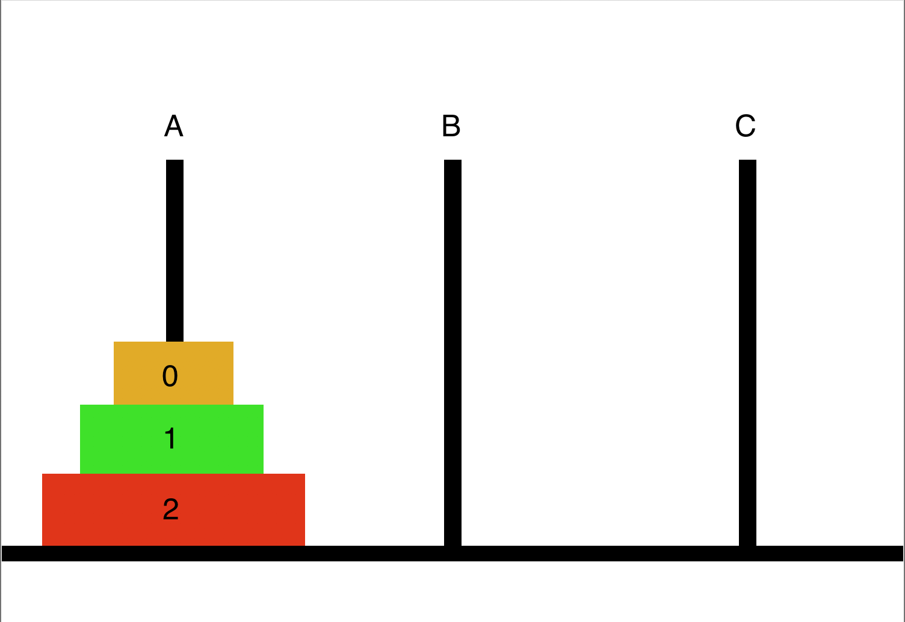

# Towers Of Hanoi Algorithm

The towers of hanoi is a mathematical puzzle. We have three towers (or rods or peg), and a number of disks of different sizes which can slide into any tower.

The puzzle starts with the disks on one tower in ascending order of size, the smallest at the top, making a conical shape.

The objective of the puzzle is to move entire stack on another tower with satisfying below rules.

## Rules

- Only one disk can be moved at a time.
- Each move consists of taking the upper disk from one of the towers and sliding it onto another tower, on top of the other disks that may already be present on that tower.
- No disk can be placed on top of a smaller disk.



## Input

An integer determines `n` number of disks at tower A should be moved to tower C

### Input Example

```
3
```

## Output

The code you write should print out the steps needed to move all the disk from tower A to tower C

### Output Example

```
A -> C
A -> B
C -> B
A -> C
B -> A
B -> C
A -> C
```
